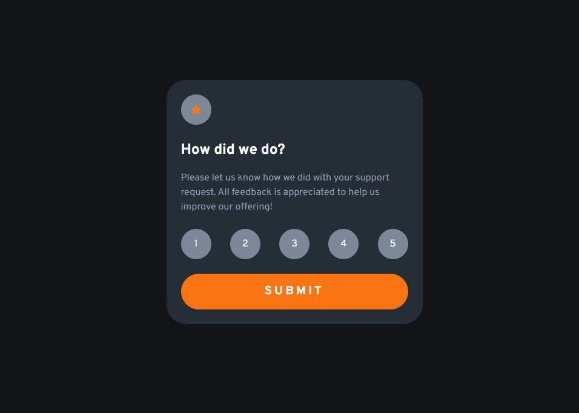

# Frontend Mentor - Interactive rating component solution

This is a solution to the [Interactive rating component challenge on Frontend Mentor](https://www.frontendmentor.io/challenges/interactive-rating-component-koxpeBUmI). Frontend Mentor challenges help you improve your coding skills by building realistic projects.

## Table of contents

- [Overview](#overview)
  - [The challenge](#the-challenge)
  - [Screenshot](#screenshot)
  - [Links](#links)
- [My process](#my-process)
  - [Built with](#built-with)
- [Author](#author)
- [Acknowledgments](#acknowledgments)

## Overview

### The challenge

Users should be able to:

- View the optimal layout for the app depending on their device's screen size
- See hover states for all interactive elements on the page
- Select and submit a number rating
- See the "Thank you" card state after submitting a rating

### Screenshot

### Links

- Solution URL: [(you are here)](https://github.com/MarcusAnglin/Frontend-Mentor_Interactive-rating-component)
- Live Site URL: [live site here](https://marcusanglin.github.io/Frontend-Mentor_Interactive-rating-component/)

## My process

### Built with

- Semantic HTML5 markup
- CSS custom properties
- Flexbox
- Mobile-first workflow

## Author

- Website - [Marcus A](https://github.com/MarcusAnglin)
- Frontend Mentor - [@MarcusAnglin](https://www.frontendmentor.io/profile/MarcusAnglin)

## Acknowledgments

Even a simple project like this can be a huge undertaking for someone who's just starting their coding journey or has only coded along to tutorials, but projects like this are a great way to build confidence and experience. I'm grateful to Frontend Mentor for hosting these projects. and [John Smilga](https://www.johnsmilga.com/) for having great tutorial content available for people like me to learn from.
